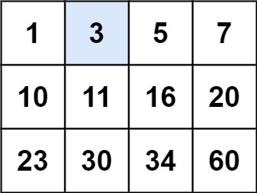

## Problem Statement
You are given an N x M integer matrix matrix with the following two properties:
- Each row is sorted in non-decreasing order.
- The first integer of each row is greater than the last integer of the previous row.
- Given an integer target, return true if target is in matrix or false otherwise.

You must write a solution in O(log(N * M)) time complexity.

> ### Example 1:
>  <br>
> **`Input:`** <br>
> matrix = [[1,3,5,7],[10,11,16,20],[23,30,34,60]], target = 3 <br>
> **`Output:`** true <br><br>

**`Constraints:`**
- N == matrix.length
- M == matrix[i].length
- 1 <= N, M <= 100
- -10^4 <= matrix[i][j], target <= 10^4

## Solutions
### Approach 1 - Linear Search

```java
class Solution {
    public boolean searchMatrix(int[][] matrix, int target) {
        int N = matrix.length, M = matrix[0].length;
        
        for (int i = 0; i < N; i++) {
            for (int j = 0; j < M; j++) {
                if (matrix[i][j] == target) return true;
            }
        }

        return false;
    }
}
```

**`Time Complexity:`** O(N * M) <br>
**`Space Complexity:`** O(1)

---
### Approach 2 - Advanced Linear Search

In the example, if we see the `top-right element` or the `bottom-left element`, you'll notice that these are special indexes that are the `middle element` of the `first row and the last column` or the `last row and first column` respectively.

Considering the `bottom-left element`, <br>
- In case `current < target`, then the only way to increase the value is to `move right` or `j++`.
- In case `current > target`, then the only way to increase the value is to `move up` or `i--`.

```java
class Solution {
    public boolean searchMatrix(int[][] matrix, int target) {
        int N = matrix.length, M = matrix[0].length;
        int i = N - 1, j = 0;

        while (i >= 0 && j < M) {
            if (matrix[i][j] == target) return true;

            if (matrix[i][j] < target) j++;
            else i--;
        }

        return false;
    }
}
```

**`Time Complexity:`** O(N + M) <br>
**`Space Complexity:`** O(1)

---
### Approach 3 - Binary Search - Column Wise or Row Wise

The below solution runs over every row and then find the target using binary search.

This can be further improved by considering if row-wise binary search is better or column-wise binary search.

```java
class Solution {
    public boolean searchMatrix(int[][] matrix, int target) {
        int N = matrix.length, M = matrix[0].length;
        int left, right, mid;

        for (int i = 0; i < N; i++) {
            left = 0;
            right = M - 1;

            while (left <= right) {
                mid = left + (right - left) / 2;

                if (matrix[i][mid] == target) return true;

                if (matrix[i][mid] < target) left = mid + 1;
                else right = mid - 1;
            }
        }

        return false;
    }
}
```

**`Time Complexity:`** O( `min`( N, M ) * `log`( `max`( N, M ) ) ) <br>
**`Space Complexity:`** O(1)

---
### Approach 4 - Binary Search using Cell Position

`Total number of cells in the matrix is given by (N * M - 1). Since the flatten matrix in the given example would also be sorted as per the given constraint, we can apply binary search on the cell positions as well.`

```java
class Solution {
    public boolean searchMatrix(int[][] matrix, int target) {
        int N = matrix.length, M = matrix[0].length;
        int left = 0, right = (N * M - 1), mid;
        int row, column;

        while (left <= right) {
            mid = left + (right - left) / 2;

            row = mid / M;
            column = mid % M;

            if (matrix[row][column] == target) return true;

            if (matrix[row][column] < target) left = mid + 1;
            else right = mid - 1;
        }

        return false;
    }
}
```

**`Time Complexity:`** O( `log`( N * M ) ) <br>
**`Space Complexity:`** O(1)

---
### Approach 5 - Row and Column Binary Search Together

```java
class Solution {
    public boolean searchMatrix(int[][] matrix, int target) {
        int N = matrix.length, M = matrix[0].length;
        int left, right, mid;
        int row = -1;

        // Row Wise Binary Search
        left = 0; right = N - 1;
        while (left <= right) {
            mid = left + (right - left) / 2;

            if (matrix[mid][M - 1] == target) return true;

            if (matrix[mid][M - 1] <= target) {
                row = mid;
                left = mid + 1;
            } else {
                right = mid - 1;
            }
        }

        // Column Wise Search
        if ((row + 1) < N) {
            left = 0; right = M - 1;

            while (left <= right) {
                mid = left + (right - left) / 2;

                if (matrix[row + 1][mid] == target) return true;

                if (matrix[row + 1][mid] < target) left = mid + 1;
                else right = mid - 1;
            }
        }

        return false;
    }
}
```

**`Time Complexity:`** O( `log`( N + M ) ) <br>
**`Space Complexity:`** O(1)

---