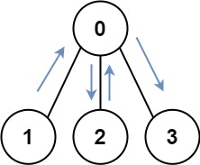

## Problem Statement
You have an undirected, connected graph of N nodes labeled from `0` to `N - 1`. You are given an array graph where `graph[i]` is a list of all the nodes connected with node `i` by an edge.

Return the `length of the shortest path that visits every node`. You may start and stop at any node, you may revisit nodes multiple times, and you may reuse edges.

> ### Example 1:
>  <br>
> **`Input:`** graph = [[1, 2, 3], [0], [0], [0]] <br>
> **`Output:`** 4 <br>
> **`Explanation:`** One possible path is [1,0,2,0,3] <br><br>

> ### Example 2:
>  <br>
> **`Input`**: graph = [[1], [0, 2, 4], [1, 3, 4], [2], [1, 2]] <br>
> **`Output:`** 4 <br>
> **`Explanation:`** One possible path is [0,1,4,2,3] <br><br>
 

**`Constraints:`**
- N == graph.length
- 1 <= N <= 12
- 0 <= graph[i].length < n
- graph[i] does not contain i.
- If graph[a] contains b, then graph[b] contains a.
- The input graph is always connected.

## Solutions
### Approach 1 - BFS - Graph Traversal

`There are two techniques for Graph Traversals` <br>
1. Depth First Search (DFS)
1. Breadth First Search (BFS)

Whenever, we need to find the `minimum distance or minimum cost to travel`, we always choose the `BFS Approach`. <br>
Since for this question, we are given that the N ranges from [1, 12], the visited nodes can be compared using `BIT MASKING`.

```java
class Solution {
    class Pair {
        int node, dist, mask;

        Pair (int node, int mask) {
            this.node = node;
            this.mask = mask;
        }

        Pair (int node, int dist, int mask) {
            this.node = node;
            this.dist = dist;
            this.mask = mask;
        }
    }

    public int shortestPathLength(int[][] A) {
        int N = A.length, fullBit = (1 << N) - 1;
        Queue<Pair> queue = new LinkedList<>();
        Set<Long> visited = new HashSet<>();

        // Inserting all the possible starting points
        for (int i = 0; i < N; i++) {
            int mask = (1 << i);

            // Inserting all the starting point
            queue.add( new Pair(i, 0, mask) );

            // Marking the starting point as visited.
            // Here the node is marked as visited, based on
            // unique (i, mask) pair.

            // If a node is reached again with the same mask,
            // this means that we are running along the cyclic
            // edges.
            visited.add((long) i + ((long) mask << 5));
        }

        // 
        while (!queue.isEmpty()) {
            // Popping the First Element of the Queue
            Pair current = queue.poll();

            // Checking if all the current mask is a full mask.
            if (current.mask == fullBit)
                return current.dist;

            // Iterating the Other Nodes connected to current
            for (int i : A[current.node]) {
                // Creating the New Mask Value
                int newMask = current.mask | (1 << i);

                // Creating the New Visited Key with the next
                // node and new mask.
                long newValid = (long) i + ((long) newMask << 5);

                if (!visited.contains(newValid)) {
                    visited.add(newValid);
                    queue.add( new Pair(i, current.dist + 1, newMask) );
                }
            }
        }

        return 0;
    }
}
```

**`Time Complexity:`** O(N * 2^N) <br>
**`Space Complexity:`** O(N * 2^N)

---