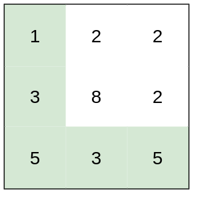

## Problem Statement
You are a hiker preparing for an upcoming hike. You are given `heights`, a 2D array of size `rows x columns`, where `heights[row][col]` represents the height of cell `(row, col)`. You are situated in the top-left cell, `(0, 0)`, and you hope to travel to the bottom-right cell, (rows-1, columns-1) (i.e., 0-indexed). You can `move up, down, left, or right`, and you wish to find a route that requires the `minimum effort`.

A route's effort is the `maximum absolute difference` in heights between two consecutive cells of the route.

`Return the minimum effort required to travel from the top-left cell to the bottom-right cell.`

> ### Example 1:
>  <br>
> **`Input:`** heights = [ [1, 2, 2], [3, 8, 2], [5, 3, 5]] <br>
> **`Output:`** 2 <br>
> **`Explanation:`** <br>
> The route of [1, 3, 5, 3, 5] has a maximum absolute difference of 2 in consecutive cells. <br>
> This is better than the route of [1, 2, 2, 2, 5], where the maximum absolute difference is 3. <br><br>

**`Constraints:`**
- rows == heights.length
- columns == heights[i].length
- 1 <= rows, columns <= 100
- 1 <= heights[i][j] <= 10^6

## Solutions
### Approach 1 - Dijkstra Algorithm

```java
class Solution {
    class Tuple {
        int i, j, effort;

        public Tuple (int i, int j, int effort) {
            this.i = i;
            this.j = j;
            this.effort = effort;
        }
    }

    public int minimumEffortPath(int[][] A) {
        int N = A.length, M = A[0].length;
        Tuple current;

        // Priority Queue to get the least distance at the top.
        PriorityQueue<Tuple> pq =
            new PriorityQueue<>((X, Y) -> (X.effort - Y.effort));

        // Movement Directions.
        int[][] dir = new int[][] {
            new int[] {0, -1},
            new int[] {0, 1},
            new int[] {-1, 0},
            new int[] {1, 0}
        };

        // Array to hold the minimum effort calculated for the cell.
        int[][] dist = new int[N][M];

        // Initialising the dist array with the MAX value.
        for (int i = 0; i < N; i++) {
            for (int j = 0; j < M; j++) {
                dist[i][j] = Integer.MAX_VALUE;
            }
        }
        dist[0][0] = 0;

        // Adding the Starting Position.
        pq.offer(new Tuple(0, 0, 0));

        while (!pq.isEmpty()) {
            current = pq.poll();

            // When the transaction reaches the Destination.
            if (current.i == (N - 1) && current.j == (M - 1))
                return current.effort;

            // Moving to the neighbouring cells.
            for (int k = 0; k < 4; k++) {
                // Getting the new i and j positions
                int i = current.i + dir[k][0];
                int j = current.j + dir[k][1];

                // Validating the new cell
                if (i >= 0 && j >= 0 && i < N && j < M) {
                    int effort = Math.max(
                        current.effort,
                        Math.abs(A[i][j] - A[current.i][current.j])
                    );

                    // Adding to the priority queue only if the
                    // new effort is less than the effort already
                    // calculated to reach the cell from a diff
                    // position.
                    if (effort < dist[i][j]) {
                        dist[i][j] = effort;
                        pq.offer(new Tuple(i, j, effort));
                    }
                }
            }
        }

        return 0;
    }
}
```

**Time Complexity:** O(N * M * log(N * M)), `where M and N are the dimensions of the grid. This is primarily due to the operations on the priority queue.` <br><br>
**Space Complexity:** O(N * M), `needed for the distance matrix and the priority queue.`

---