## Table of Contents
- [Basic Ubuntu Commands](#basic-ubuntu-commands)
- [**Setting up the EC2 Server**](#setting-up-the-ec2-server)
    - [Installing Apache](#installing-apache)
    - [Setting up Domain - EC2 Ubuntu](#setting-up-domain---ec2-ubuntu)
    - [Setting up Subdomain - EC2 Ubuntu](#setting-up-subdomain---ec2-ubuntu)
    - [Creating a Route53 for the purchased Domains](#creating-a-route53-for-the-purchased-domains)
    - [Linking Route53 NameServers with the Domains](#linking-route53-nameservers-with-the-domains)
- **Jenkins**
    - [Installing Jenkins on EC2 Ubuntu](#installing-jenkins)

## Basic Ubuntu Commands
**`clear`** <br>
Clears the current SSH terminal.

**`ls`** <br>
This command is used to get the list of all the files and folders in the current working directory.

**`ls -al`** <br>
This command is ised to get the llist of all the files and folders *`(including hidden ones)`* in the current working directory.

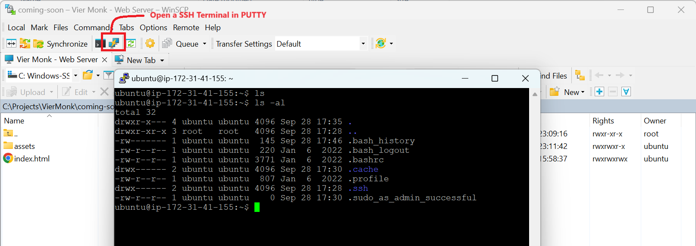

**`sudo apt update`** <br>
This command is used to update the package lists on your Linux system.

**`sudo apt upgrade`** <br>
This command is used to installs newer versions of the packages you have. After updating the lists, the package manager knows about available updates for the software you have installed. This is why you first want to *`update`*.

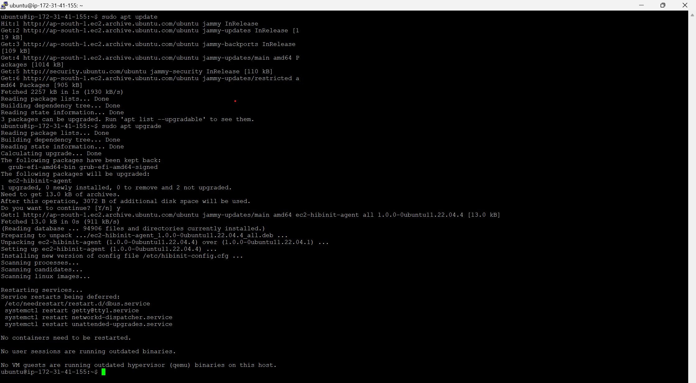

**`sudo ufw app list`** <br>
**`sudo ufw status`** <br>
The Uncomplicated Firewall (UFW) is a command-line firewall abstraction layer that automatically uses either iptables or nftables as a back-end firewall. UFW is a tool that minimizes the effort of setting up a firewall by starting with an optimal default configuration.

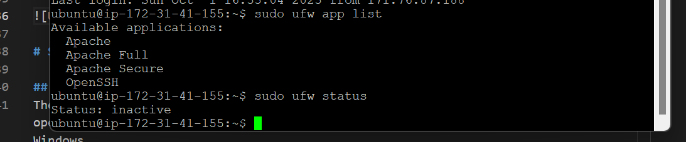

# Setting up the EC2 Server

## Installing Apache
The `Apache HTTP Server Project` is an effort to develop and maintain an open-source HTTP server for modern operating systems including UNIX and Windows.

```
sudo apt install apache2
```

For the web access make sure that `HTTP` and `HTTPS` ports are open on your `Security Group` attached to the `EC2 instance`.

When you access the IP address of your website for the first time, you'll find the Apache Home Page running.

## Setting up Domain - EC2 Ubuntu
For this step, buy and register your domain using any of the service providers (eg. GoDaddy, NameCheap, etc.). We would be buying the domain using GoDaddy below.

1. Create an account on GoDaddy.com.
1. Login into your account and go to `My Products`.

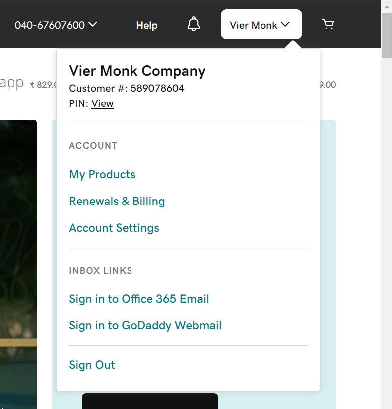

3. Enter the domain you are looking for and proceed with the checkout.

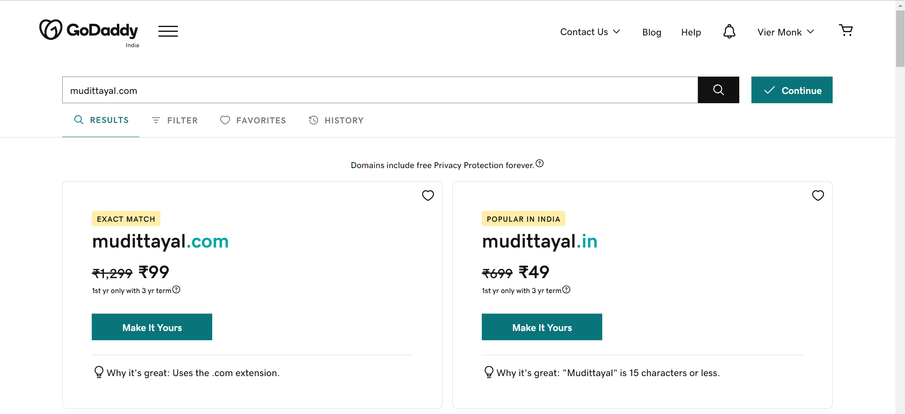

4. After purchasing the domain, you'll see your domain products over the `My Product` page.

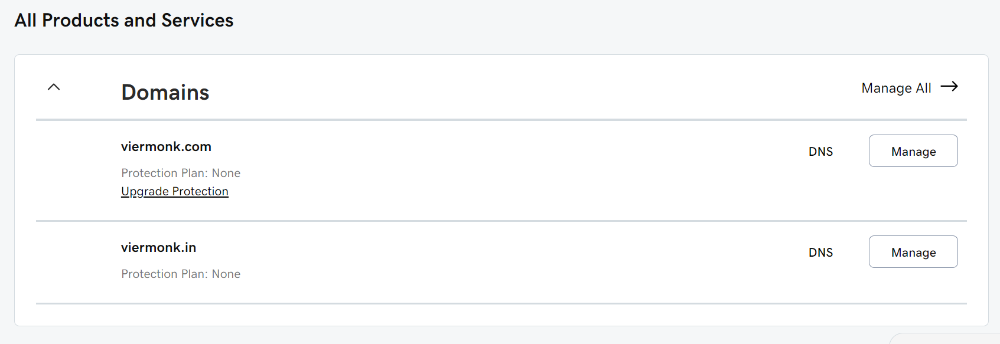

5. Every domain is linked with a set of `NameServers` that `holds the IP Address of the server` to connect to. We can launch our new servers using AWS, FireBase, etc. and then link the new set of nameservers with the domain bought on GoDaddy.com

## Creating a Route53 for the purchased Domains

1. Login to your `AWS Console`.
1. In the search box above, search for `Route 53`. <br>`AWS Route 53 is a Domain Name Registration Service provided by AWS`.

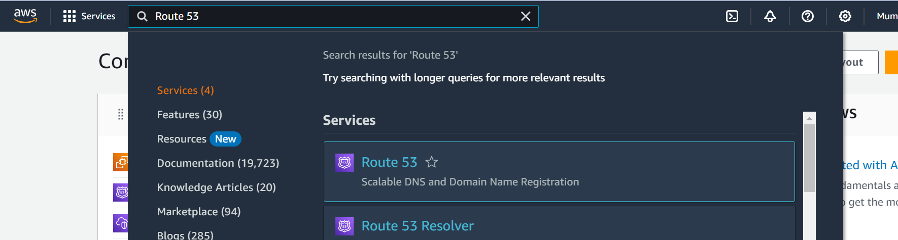

3. Click on `Hosted Zones` and then select `Created Hosted Zone`.

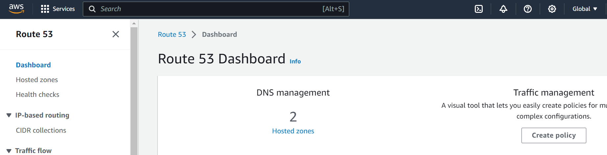

4. We need to create a Hosted Zone for every `Top-Level-Zone` (eg. .com, .in, .co.in, etc.)


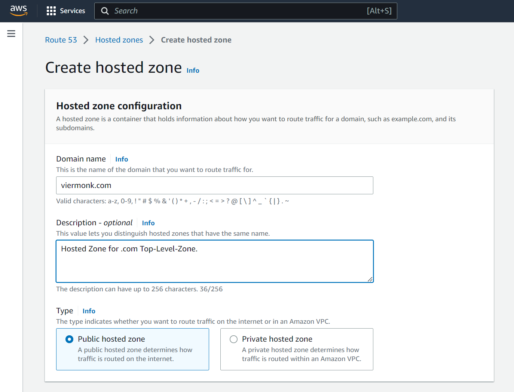

5. Once a Hosted Zone has been created, you'll find 2 records created in side the Hosted Zone.
    - `NS - Name Servers`
        - The nameserver tells the browser where that domain is located (i.e., the address of your web host).
    - `SOA - Start of Authority`
        - Stores important information about a domain or zone such as the email address of the administrator, when the domain was last updated, and how long the server should wait between refreshes.

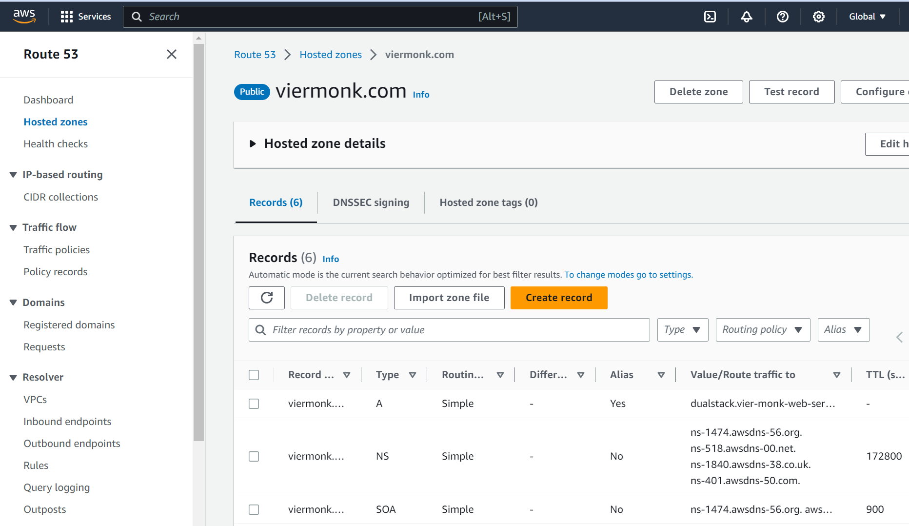

## Linking Route53 NameServers with the Domains

## Adding a SSL certificate to the Domain

## Setting up Subdomain - EC2 Ubuntu

## Installing Jenkins
Jenkins has been implemented using `java`, therefore, before installing the Jenkins Server, we need to install `java` on our current running instance.

Before installing java, run the `sudo apt update` and `sudo apt upgrade` commands on your machine.

**`sudo apt install fontconfig openjdk-17-jre`** <br>
This command is used to install `fontconfig` and `openjdk-17-jre` on the current running instance.

- `fontconfig` <br>
    - Fontconfig is a library for configuring and customizing font access. <br>
- `openjdk-17-jre` <br>
    - Java Version 17.

**`java -version`** <br>
This command is used to check the java version on the current running instance.

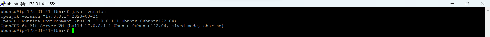

Once `java` is installed we will now move forward with installing the Jenkins Server on our current running instance. For an `UBUNTU` machine, we would require a `debian` package to be installed. The same can be visited using this [`link`](https://pkg.jenkins.io/debian-stable/).

Below are the commands we would be executing.

1. `This is the Debian package repository of Jenkins to automate installation and upgrade. To use this repository, first add the key to your system.`
    - The `'sudo tee \'` command allows us to write to a file having sudo privilege.
    - The `'> /dev/null'` command is used to redirect the output to the null or simply discard the same.

    ```
    curl -fsSL https://pkg.jenkins.io/debian-stable/jenkins.io-2023.key | sudo tee \
    /usr/share/keyrings/jenkins-keyring.asc > /dev/null
    ```

1. `Then add a Jenkins apt repository entry:`
    ```
    echo deb [signed-by=/usr/share/keyrings/jenkins-keyring.asc] \
    https://pkg.jenkins.io/debian-stable binary/ | sudo tee \
    /etc/apt/sources.list.d/jenkins.list > /dev/null
    ```

1. `Update your local package index, then finally install Jenkins:`
    ```
    sudo apt update
    sudo apt-get install jenkins
    ```

1. `Checking the status of the Jenkins Service`
    - The `systemctl` command manages both system and service configurations, enabling administrators to manage the OS and control the status of services.
    ```
    sudo systemctl start jenkins
    sudo systemctl enable jenkins
    sudo systemctl status jenkins
    ```

    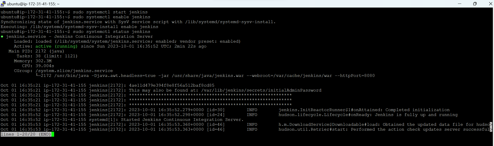