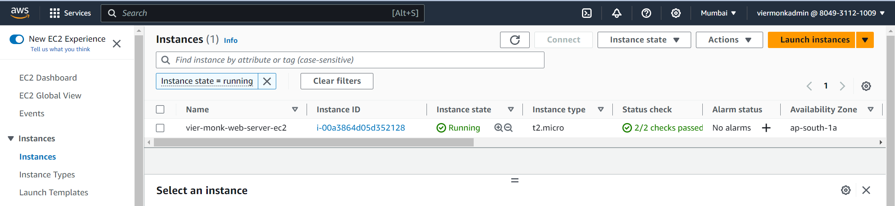

## Launching EC2 Instance (Ubuntu)

`Amazon EC2 refers to Amazon Elastic Compute Cloud (Amazon EC2)` provides on-demand, scalable computing capacity in the Amazon Web Services (AWS) Cloud. Using Amazon EC2 reduces hardware costs so you can develop and deploy applications faster.

### **`Step 1`**
Login to your `AWS Console` and in the search bar above search `EC2`.

---

### **`Step 2`**
Click on `EC2`, this will open your EC2 dashboard on the console.

---

### **`Step 3`**
1. On the dashboard, select `Instances (Running)`.

---

### **`Step 4`**
1. As you can see above, I already have one running instance on my console. However, we would be `creating a new console, configure it step-by-step and replace this running instance`. Click on `Launch Instance` to open the `Create Instance Wizard`.
    
    - Enter the `Instance Name`
    

    - Select the `Application and OS Images (AMI - Amazon Machine Image)`
    

    - Select the `Instance Type`
    

    - Select the `Key Pair` or `Generate a New One`.
    
    To create a new `Key Pair` click on `Click new key pair`.
    
    Once you click on `Create key pair`, this would download the `.pem` file, keep this file safe as this would be used to login to the server later.
    

    - Configure the `Network Settings`.

        - Click on the `Edit` button, to unlock additional features.
        

        - Enter the `Security Group Name` and `Description`.
        
        

    - Configure the `Storage`. In the free tier, upto 30 GB of storage is free.
    

    - Click on `Launch Instance`.
    
---

### **`Step 5`**
1. Once you create the Instnace, initially it would be in the `Pending State`.

After sometime, the state of the Instance would change to `Running` and Status Check will show `2/2 checks passed`.

---

### **`Step 6`**
1. If you open the IP Address right now, you'll get an error saying `The site cant be reached`.

`In the next step, we would be installing Apache2 on the server and adding our first HTML file`.

[**Next Page ( Installing Apache2 )**](./02-installing-apache2.md)

---