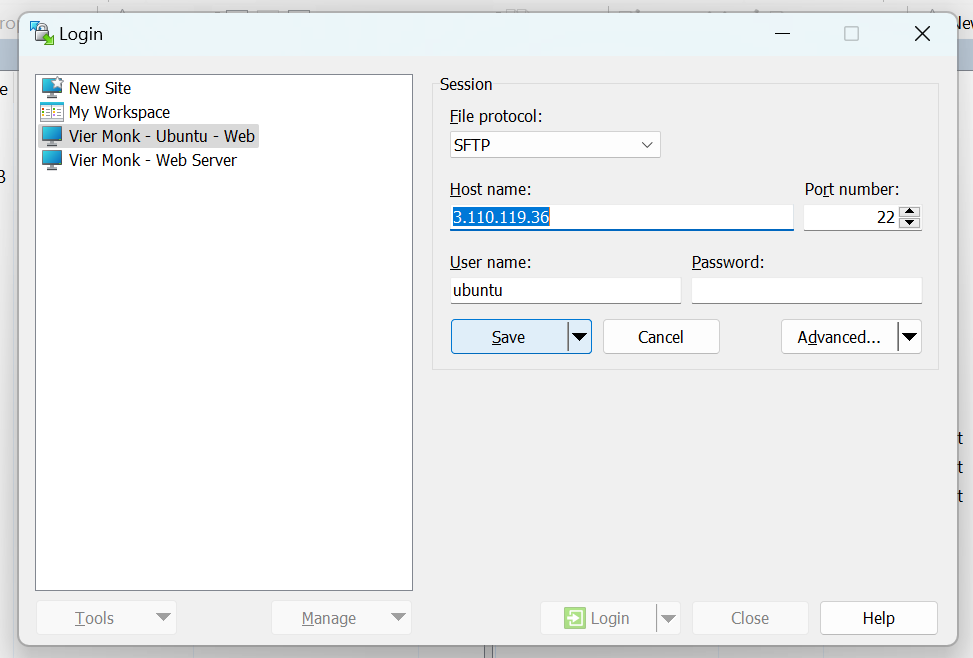
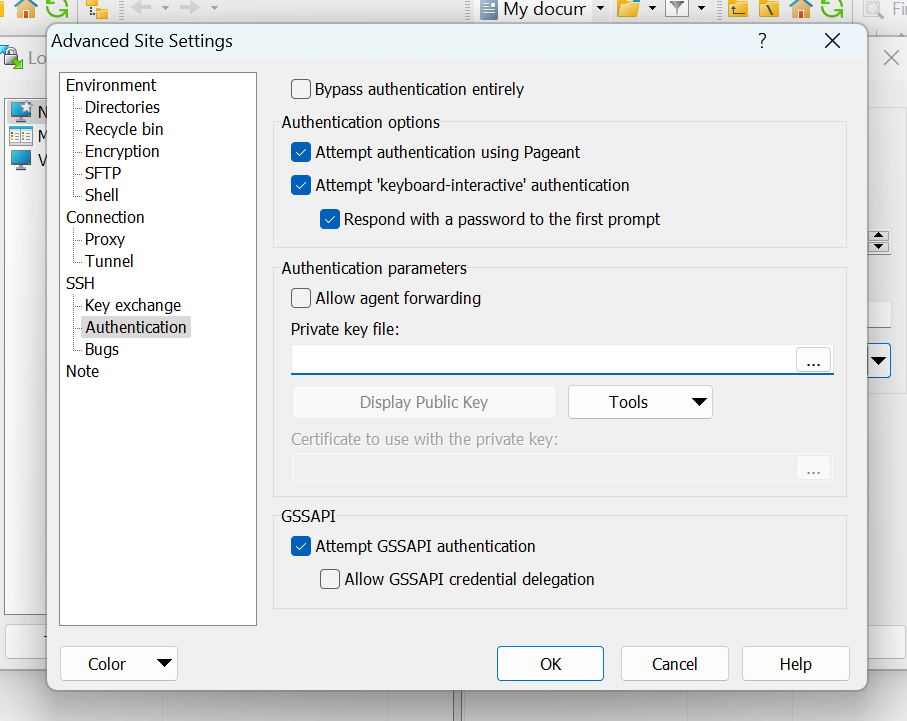
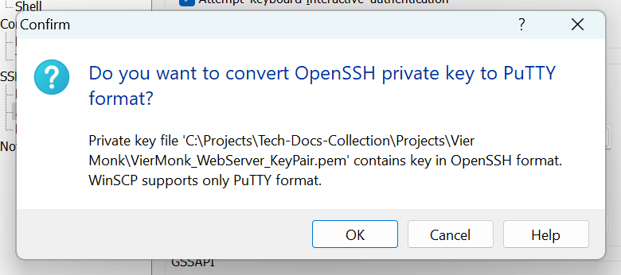
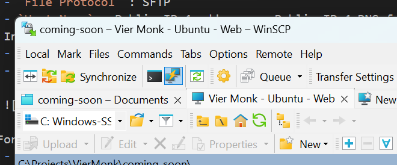
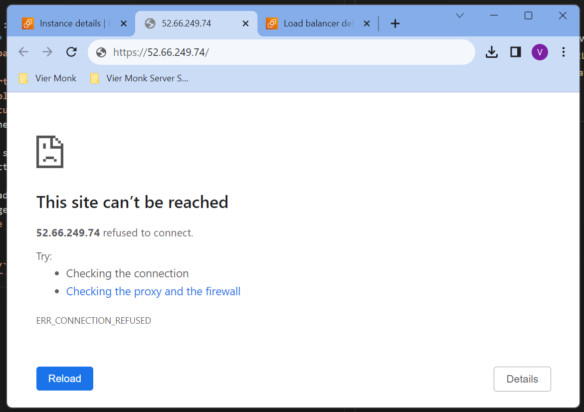
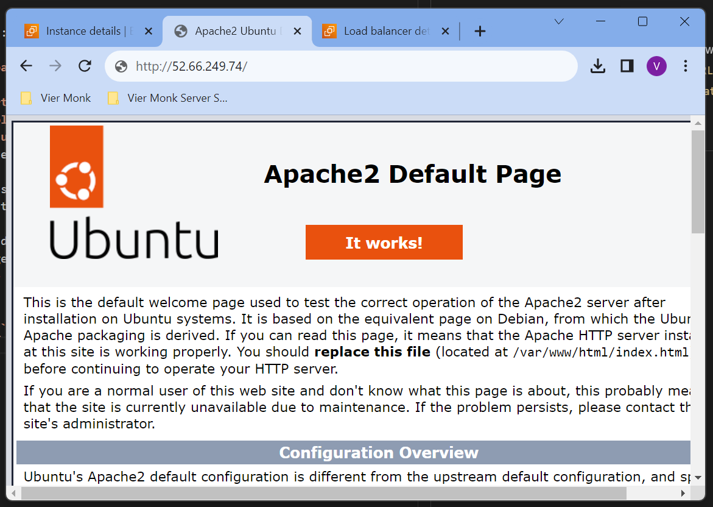

## Configuring Apache2 and Hosting your first HTML file

The Apache HTTP Server is a free and open-source cross-platform web server software, released under the terms of Apache License 2.0. It is developed and maintained by a community of developers under the auspices of the Apache Software Foundation.

Inorder to access your server, we would be using PUTTY and WinSCP. Install both of these softwares on your machine.

### **`Step 1:`**
Open `WinSCP` <br> Click on `New Site`
- `File Protocol` : SFTP
- `Host Name` : Public IPv4 address or Public IPv4 DNS for your EC2 Instance
- `Port Number` : The Port Number you made active for SSH access.
- `User Name` : ubuntu (Default User Name)



---

### **`Step 2:`**
For the `Password` Field, click on `Advanced..`.
- `Authentication` > Under the `Private Key File` select your .pem file.

- You will now be prompted with converting the `.pem` file to `.ppk`.

- Click `OK` and save your `.ppk` file and keep it safe.

---

### **`Step 3:`**
Save your `WinSCP Configuration` so that you dont have to do the same steps everytime you try to connect. Then hit `Login`.

---

### **`Step 4:`**
We would now be installing `Apache2` on our server. Click on the `Open Session in PuTTY` icon, the one highlighted below.


This will open you session using the PuTTY terminal. Enter the following commands.

    ```
    sudo apt update
    sudo apt upgrade
    sudo apt install apache2 -y

    sudo systemctl start apache2
    sudo systemctl enable apache2
    sudo systemctl status apache2

    sudo ufw app list
    sudo ufw status
    sudo ufw enable
    ```

- **`sudo apt update`** : Updates the package list.
- **`sudo apt upgrade`** : Upgrade the packages.
- **`sudo apt install apache2 -y`** : Installing Apache2 with a confirmation `-y`.
- **`sudo systemctl start apache2`** : Start the Apache2 Service.
- **`sudo systemctl enable apache2`** : Enable the Apache2 Service.
- **`sudo systemctl status apache2`** : Check the status of the Apache2 Service, should be in the running state.

For the web access make sure that `HTTP` and `HTTPS` ports are open on your `Security Group` attached to the `EC2 instance`.

When you access the IP address of your website for the first time, you'll find the Apache Home Page running. `Check the URL, the URL should be HTTP and not HTTPS because we haven't yet added a SSL certificate to access using https://.`

---

### **`HTTP and HTTPS Access States`**

**`https://52.66.249.74/`**


**`http://52.66.249.74/`**


---