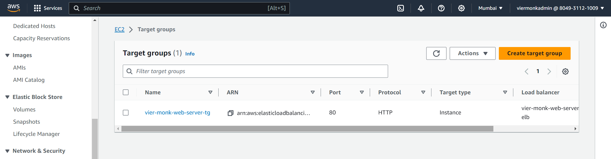
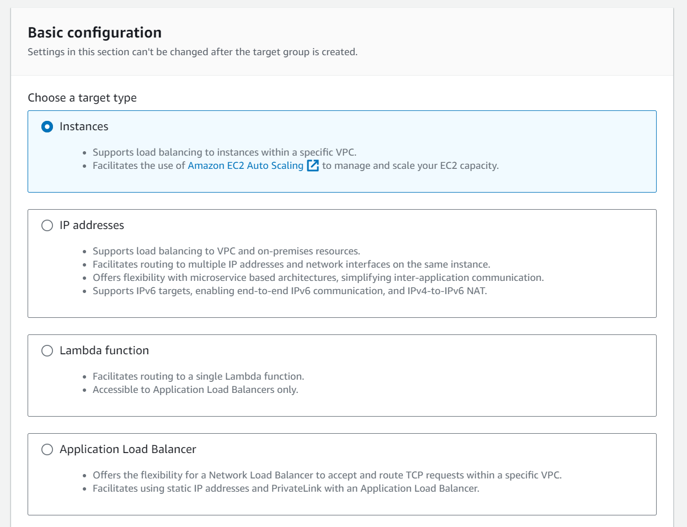
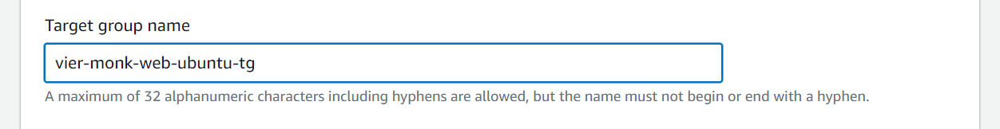
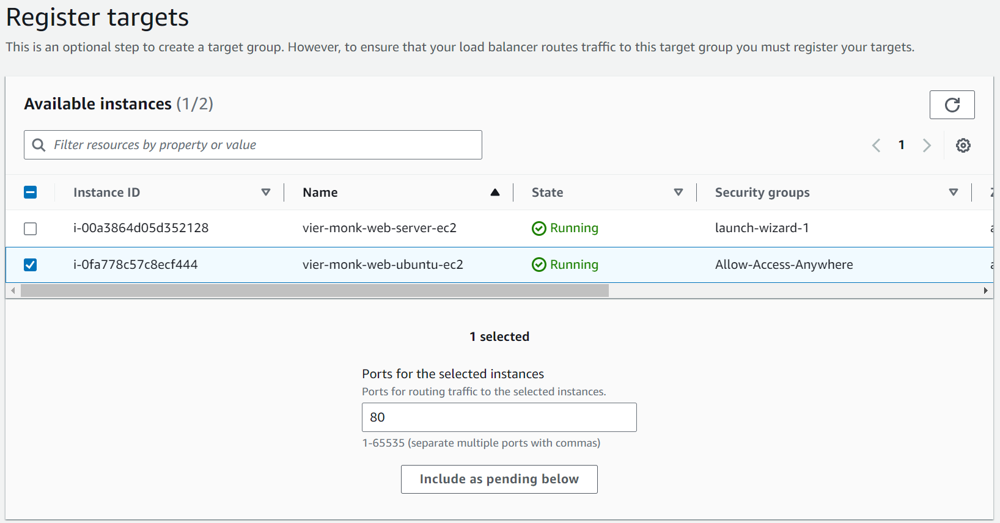
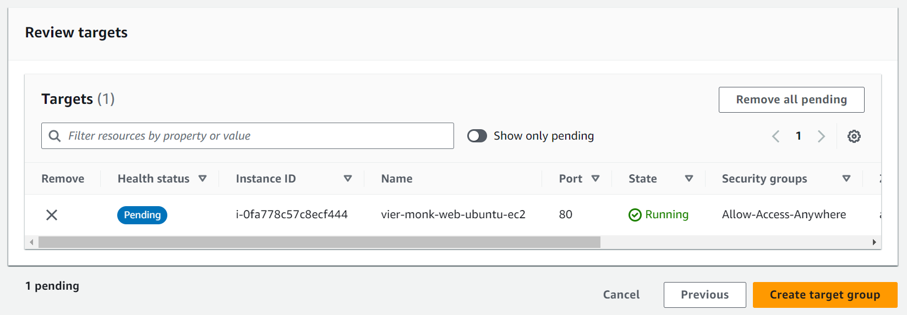
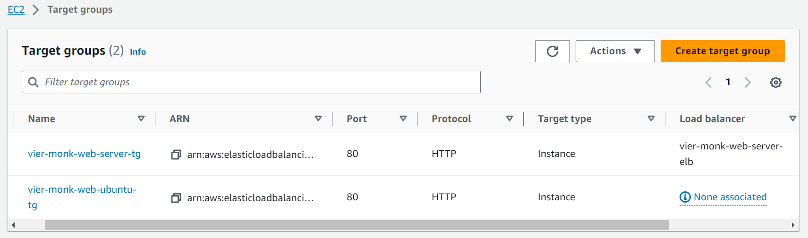

## Creating a Target Group

Target groups `route requests to individual registered targets`, such as EC2 instances, using the protocol and port number that you specify.

In future, if multiple instances need to be created, we would be adding them to the target group. The load balancer will `redirect the traffic according to the instance availability equally`.

---

1. Go to `EC2` > `Load Balancing` > `Target Group`.
    

1. Click on `Create Target Group`.
    - `Choose a Target Group` : Select `Instances`.
        

    - Enter the `Target Group Name`.
        

    - Leave rest all the default configurations, and click `Next`. On the next screen, you'll see the list of instances, select the instances you want to add to the `Target Group` and click on `Include as pending below`.
        

    - Review your selctions and click `Create target group`.
        

    - For the time being, the target group will show `None Associated`.
        

--- 
