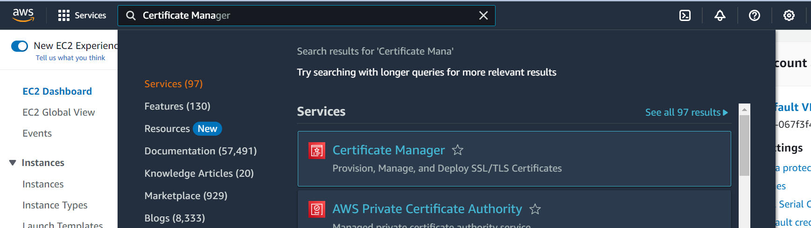
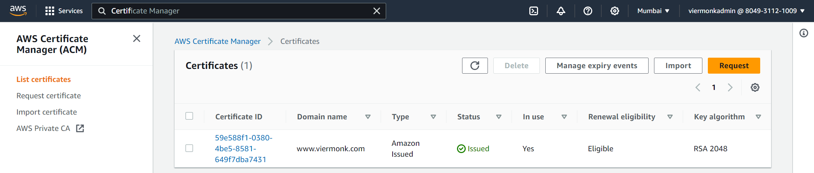
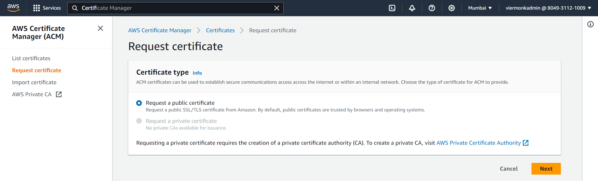
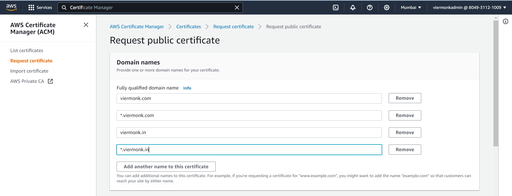
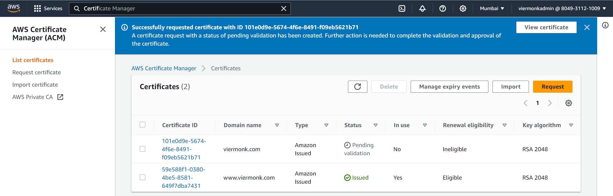
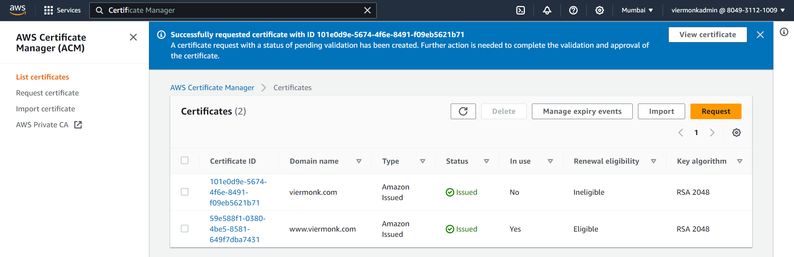

## Creating a Free Public SSL Certificate

### **`Step 1`**
In the search box above, search for `Certificate Manager`. Click on `Certificate Manager` to open the `AWS Certificate Manager Console`.

---

### **`Step 2`**
You can view all the issued certificates here. Click on `Request` to create a new one.

---

### **`Step 3`**
Select `Request a Public Ceryificate`. Click `Next`.

---

### **`Step 4`**
Enter the domain names against which you want the certificate to be created.  
Enter one `without any subdomain` and the other one with a `wildcard (*)` to secure all the subdomains.  
Leave all the other settings as it is and click `Create`.

---

### **`Step 5`**
Initially the certificate would show `Pending Validation`.

After sometime the same would change to `Issued`.

---