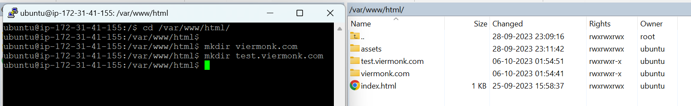
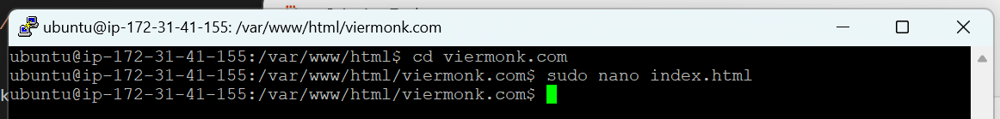
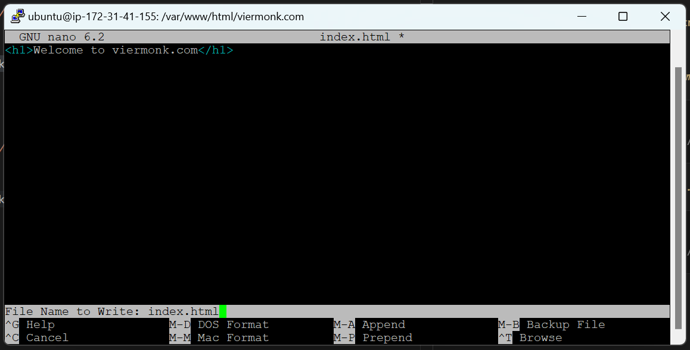
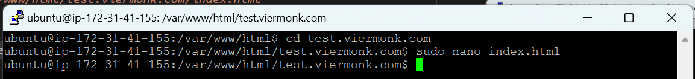
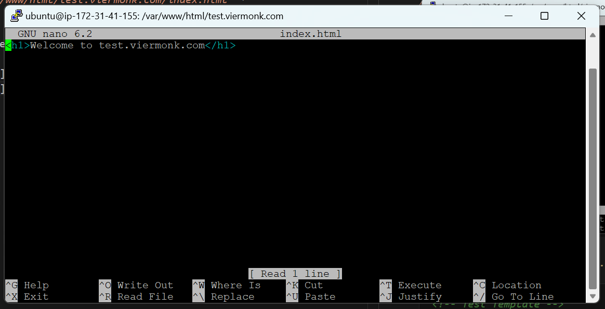
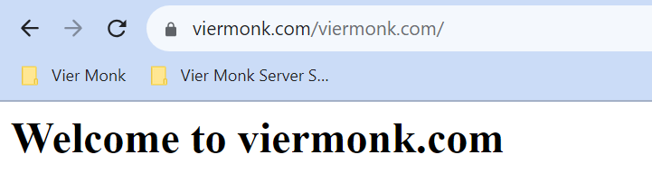
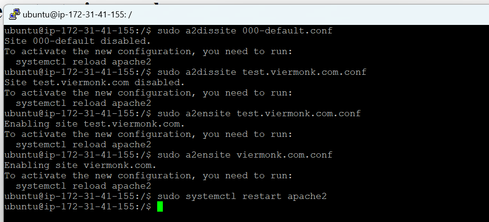
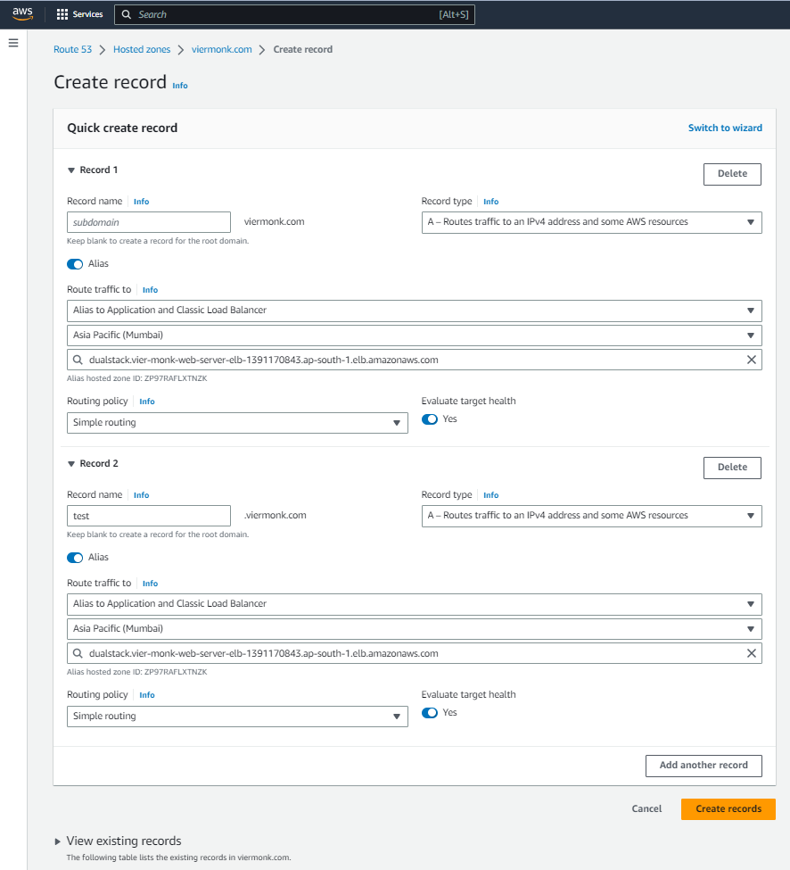

## Creating Sub Domains for your Website

For our website, we would be `configuring 2 subdomains`:
- `viermonk.com` (Production)
- `test.viermonk.com` (Test)

---

### **`Step 1`**
First, we would be creating our `subdomain directories`.


---

### **`Step 2`**
Next, we would be creating `index.html templates` for the two folders, for testing successful creation of the subdomains.

File Address : *`"/var/www/html/viermonk.com/index.html"`*
```html
<!-- Prod Template -->
<h1>Welcome to viermonk.com</h1>
```




File Address : *`"/var/www/html/test.viermonk.com/index.html"`*
```html
<!-- Test Template -->
<h1>Welcome to test.viermonk.com</h1>
```



---

### **`Step 3`**
When accessing the mentioned folders on the URL.

Link: *`https://www.viermonk.com/viermonk.com/`*


Link: *`https://www.viermonk.com/test.viermonk.com/`*


---

### **`Step 4`**
Next, we would be creating our `Apache2 Site Configuration Files`.

URL : *`test.viermonk.com`*
```
cd /
cd /etc/apache2/sites-available
sudo nano test.viermonk.com.conf
```

Paste the below configuration.

```
<VirtualHost *:80>
	ServerName test.viermonk.com
	ServerAlias www.test.viermonk.com
	DocumentRoot /var/www/html/test.viermonk.com
	ErrorLog ${APACHE_LOG_DIR}/error.log
	CustomLog ${APACHE_LOG_DIR}/access.log combined
</VirtualHost>
```

URL : *`viermonk.com`*
```
cd /
cd /etc/apache2/sites-available
sudo nano viermonk.com.conf
```

Paste the below configuration.

```
<VirtualHost *:80>
	ServerName viermonk.com
	ServerAlias www.viermonk.com
	DocumentRoot /var/www/html/viermonk.com
	ErrorLog ${APACHE_LOG_DIR}/error.log
	CustomLog ${APACHE_LOG_DIR}/access.log combined
</VirtualHost>
```

Next, `disable the default conf file` and `enable the two new config files`.

```
sudo a2dissite 000-default.conf
sudo a2dissite test.viermonk.com.conf
sudo a2dissite viermonk.com.conf
sudo systemctl restart apache2
```



---

### **`Step 5`**
Now we would be creating `two subdomains for our Route53`, both of them redirecting to the same `Load Balancer`. <br>

This would help us using `two different subdomains or A records` for `two environments` in `Route53`.



Doing so, we would be able to use two subdomain for our website.
- viermonk.com
- test.viermonk.com

---

