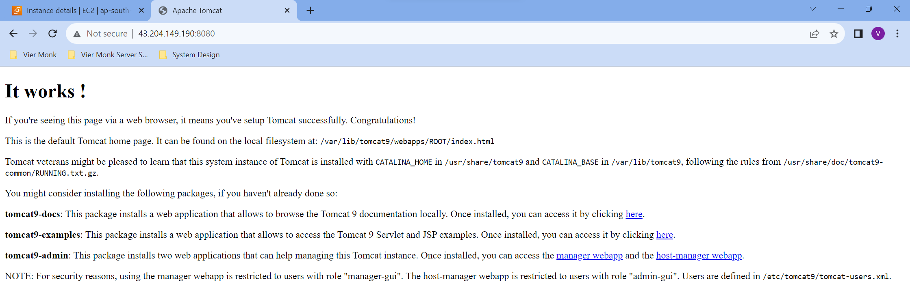

## Installing Dependencies

### `Installing Tomcat 9`
You’ll now install the `JDK`. First, `update the package manager cache` by running:
```sh
sudo apt update && sudo apt upgrade -y
```

Installing `Java Development Kit (JDK)`:
```sh
sudo apt install openjdk-11-jdk -y
java -version
```

Installing `tomcat9`:
```
sudo apt install tomcat9 -y
```

`Start` and `Enable` the `tomcat9.service`:
```sh
sudo systemctl start tomcat9
sudo systemctl enable tomcat9
```



---

### `Configuring Admin Users`
