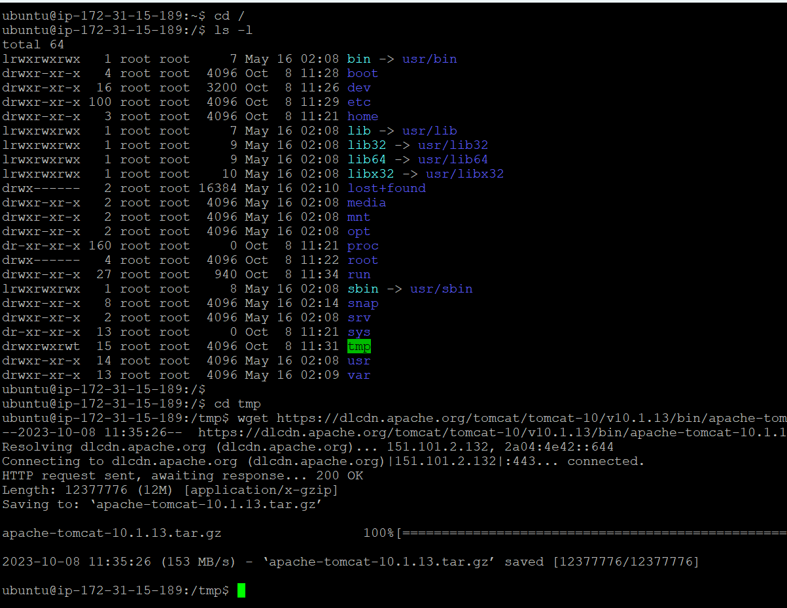
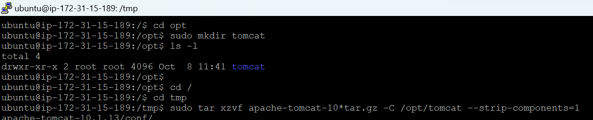
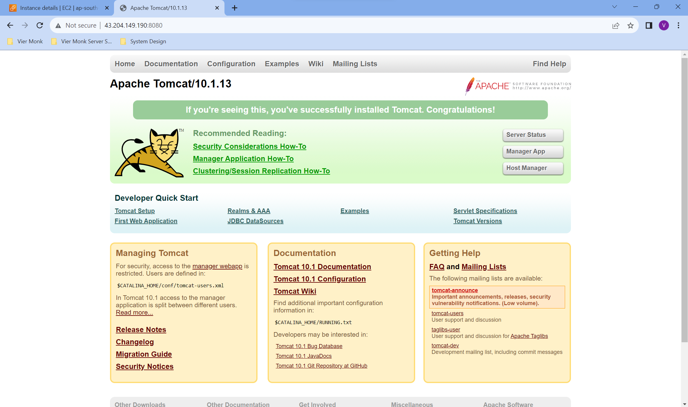

## Installing Dependencies

### `Installing Java Development Kit (JDK)`

You’ll now install the `JDK`. First, `update the package manager cache` by running:
```
sudo apt update
```
Then, install the `JDK` by running the following command:
```
sudo apt install openjdk-17-jdk -y
```
Answer y when prompted to continue with the installation.

When the installation finishes, `check the version of the available Java installation`:
```
java -version
```

The `output` should be similar to this:
```
Output
openjdk version "17.0.8.1" 2023-08-24
OpenJDK Runtime Environment (build 17.0.8.1+1-Ubuntu-0ubuntu122.04)
OpenJDK 64-Bit Server VM (build 17.0.8.1+1-Ubuntu-0ubuntu122.04, mixed mode, sharing)
```
---

### `Download Apache Tomcat`
To install `Tomcat`, you’ll need the latest `Core Linux build for Tomcat 10`, which you can get from the [downloads page](https://tomcat.apache.org/download-10.cgi). Select the `latest Core Linux build`, ending in `.tar.gz`. At the time of writing, the latest version was `10.1.13`.

```sh
# Move to the root directory
cd /

# List the files and folders
ls -l

# First, navigate to the /tmp directory:
# Download the archive using wget by running the following command:
cd tmp
wget https://dlcdn.apache.org/tomcat/tomcat-10/v10.1.13/bin/apache-tomcat-10.1.13.tar.gz
```



---

### `Installing Apache Tomcat`

The wget command downloads resources from the Internet.

```sh
# Create a new folder inside "/opt" called tomcat, where we would be extracting the .tar.gz
cd /opt
sudo mkdir tomcat
cd /
cd tmp

# Then, extract the archive you downloaded by running:
sudo tar xzvf apache-tomcat-10*tar.gz -C /opt/tomcat --strip-components=1
```



For security purposes, Tomcat should run under a separate, unprivileged user. Run the following command to create a user called `tomcat`:
```sh
sudo useradd -m -d /opt/tomcat -U -s /bin/false tomcat
```

You can now grant `tomcat ownership` over the extracted installation by running:
```sh
sudo chown -R tomcat:tomcat /opt/tomcat/
sudo chmod -R u+x /opt/tomcat/bin
```

Both commands update the settings of your tomcat installation.

---

### `Configuring Admin Users`
To gain access to the `Manager` and `Host Manager` pages, you’ll define privileged users in Tomcat’s configuration. You will need to remove the IP address restrictions, which disallows all external IP addresses from accessing those pages.

Tomcat users are defined in `/opt/tomcat/conf/tomcat-users.xml`. Open the file for editing with the following command:

```sh
sudo nano /opt/tomcat/conf/tomcat-users.xml
```

Add the following lines before the ending tag, replace highlighted passwords with your own. When you’re done, save and close the file:

```sh
<role rolename="manager-gui" />
<user username="manager" password="manager_password" roles="manager-gui" />

<role rolename="admin-gui" />
<user username="admin" password="admin_password" roles="manager-gui,admin-gui" />
```

Here you define two user roles, `manager-gui and admin-gui`, which allow `access to Manager and Host Manager pages`, respectively. You also define two users, manager and admin, with relevant roles.

By default, Tomcat is configured to restrict access to the admin pages, unless the connection comes from the server itself. To access those pages with the users you just defined, you will need to edit config files for those pages.

To remove the restriction for the `Manager` page, open its config file for editing:

```
sudo nano /opt/tomcat/webapps/manager/META-INF/context.xml
```

Comment out the Valve definition, as shown:

```
...
<Context antiResourceLocking="false" privileged="true" >
  <CookieProcessor className="org.apache.tomcat.util.http.Rfc6265CookieProcessor"
                   sameSiteCookies="strict" />
<!--  <Valve className="org.apache.catalina.valves.RemoteAddrValve"
         allow="127\.\d+\.\d+\.\d+|::1|0:0:0:0:0:0:0:1" /> -->
  <Manager sessionAttributeValueClassNameFilter="java\.lang\.(?:Boolean|Integer|Long|Number|String)|org\.apache\.catalina\.filters\.Csr>
</Context>
```

Save and close the file, then repeat for Host Manager and Documentation as well:

```
sudo nano /opt/tomcat/webapps/host-manager/META-INF/context.xml
sudo nano /opt/tomcat/webapps/docs/META-INF/context.xml
```

You have now defined two users, manager and admin, which you will later use to access restricted parts of the management interface. You’ll now create a systemd service for Tomcat.

---

### `Creating a systemd service`

The `systemd` service that you will now create will keep Tomcat quietly running in the background. The `systemd` service will also restart Tomcat automatically in case of an error or failure.

Tomcat, being a Java application itself, requires the Java runtime to be present, which you installed with the JDK in step 1. Before you create the service, you need to know where Java is located. You can look that up by running the following command:

```sh
sudo update-java-alternatives -l
```

Note the path where Java resides, listed in the last column. You’ll need the path momentarily to define the service.

You’ll store the `tomcat` service in a file named `tomcat.service`, under `/etc/systemd/system`. Create the file for editing by running:

```sh
sudo nano /etc/systemd/system/tomcat.service
```

```
[Unit]
Description=Tomcat
After=network.target

[Service]
Type=forking

User=tomcat
Group=tomcat

Environment="JAVA_HOME=/usr/lib/jvm/java-1.17.0-openjdk-amd64"
Environment="JAVA_OPTS=-Djava.security.egd=file:///dev/urandom"
Environment="CATALINA_BASE=/opt/tomcat"
Environment="CATALINA_HOME=/opt/tomcat"
Environment="CATALINA_PID=/opt/tomcat/temp/tomcat.pid"
Environment="CATALINA_OPTS=-Xms512M -Xmx1024M -server -XX:+UseParallelGC"

ExecStart=/opt/tomcat/bin/startup.sh
ExecStop=/opt/tomcat/bin/shutdown.sh

RestartSec=10
Restart=always

[Install]
WantedBy=multi-user.target
```

Here, you define a service that will run Tomcat by executing the startup and shutdown scripts it provides. You also set a few environment variables to define its home directory (which is `/opt/tomcat` as before) and limit the amount of memory that the Java VM can allocate (in `CATALINA_OPTS`). Upon failure, the Tomcat service will restart automatically.

Reload the systemd daemon so that it becomes aware of the new service:

```
sudo systemctl daemon-reload
```

You can then start and check the status of the Tomcat service by typing:
```sh
sudo systemctl enable tomcat
sudo systemctl start tomcat
sudo systemctl status tomcat
```

`Make sure you have the port 8080 condfigured on your AWS Security Group.`



---

### `Enabling Reverse Proxy`

Running tomcat on port 80 requires administrative priviledges because port 80 is a priviledged port. Thus, we would be using a reverse proxy to forward all the requests to Tomcat 8080 port.

1. Install Apache HTTP Server
    ```sh
    sudo apt install apache2 -y
    ```

1. Enable the `proxy` and `proxy_http` modules by running the below commands:
    ```sh
    sudo a2enmod proxy
    sudo a2enmod proxy_http
    ```

1. 