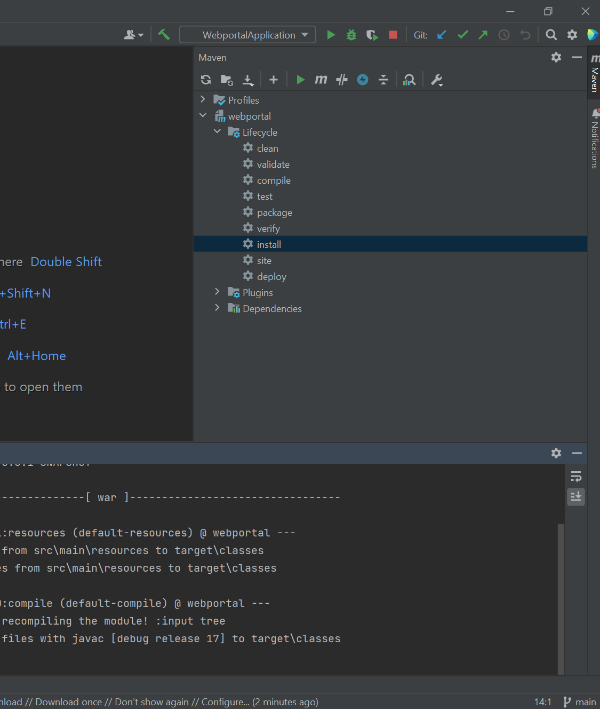
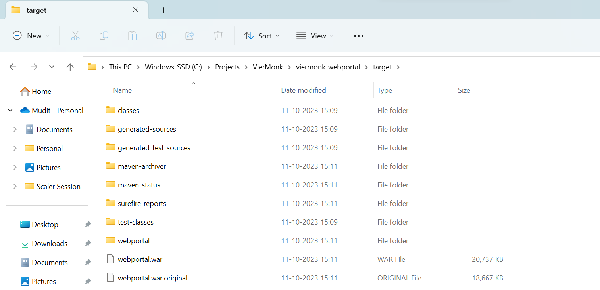
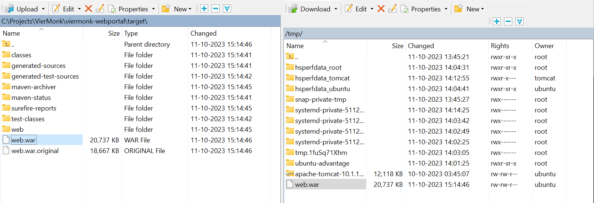

## Installing Apache2

### `Creating a WAR file`

1. Open Intellij and open your solution. On the right hand side, you'll see a `Maven Tab`. Click on it and run the `clean` and `install` scripts.


1. Once the scripts have been successfully completed, you'll find a `WAR package` created in the root directory of the project.


1. Using `WINSCP` deploy the war package to the `/tmp` folder.


1. Open `PuTTY SSH` and run the following commands
    ```sh
        // Get the ROOT user priviledges
        sudo su

        // Move to the `/opt/tomcat/webapps` directory
        cd /opt/tomcat/webapps

        // Copy the `war` package to the `webapps` folder.
        cp /tmp/web.war .
    ```

    Once, you move the `war package` to the `webapps` folder, tomcat will automatically deploy the application when it detects the new WAR file. The application context will be the same as the WAR file name.

    You can delete the war file from the `webapps` folder once the deployment has been completed.

    ```sh
    rm web.war
    ```

1. Restart the TOMCAT Service
    ```sh
    sudo systemctl restart tomcat
    ```
---