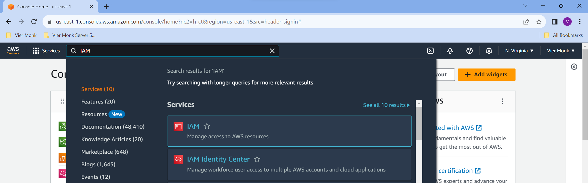

## Getting started with the AWS Account

AWS offers a `Free Tier` for 1 year. [Learn more about AWS Free Tier](https://aws.amazon.com/free/). <br>

**`Steps: `**
1. Enter the `Root User Email Address` and `AWS Account Name`. Click on `Verify email address`.
1. `Create Password`.
1. Enter `Contact Details`.
1. Enter `Billing Information`, you'll need to keep your Debit/Credit Card handy for this step.
1. Enter `Mobile Number` and Verify.
1. Select `AWS Plan`.

## Adding Multi-Factor Authentication for the Root Account

This is an optional step but recommended for better security.

`Steps: `
1. Login to your AWS console using the [*Sign In to the Console*](https://console.aws.amazon.com/console/home?nc2=h_ct&src=header-signin) option on the top-right.


2. In the search bar, enter `IAM - (Identity and Access Management)`.



3. On the screen, you'll see a `Security Recommendation` to `Add MFA for root user`. Click on the `Add MFA` button.

1. `Form 1` : Specify MFA device name
    - Device Name
    - Select the MFA Device (I've worked with the `Authenticator App`)
        - Options Google Authenticator.
1. `Form 2` : Setup your `Authenticator App`
    - You can download the Google Authenticator App and add any of the two Authentication codes.

`You are all setup. Next time you login, you'll be asked to enter the MFA Authentication Code as well.`

## Adding a New User for Access to the Console

This is a recommended step, because when working in an organisation, you would never want to share the Root Account with any of the Employees. This account should just be used to manage bills, etc.

It is recommended to add a `IAM User` and delegate the Admin Access to the same for managing AWS services.

`Steps: `
1. Login to your AWS console.
1. In the search bar, enter `IAM - (Identity and Access Management)`.
1. On the side bar, go to `Access Management` > `Users`, and click on the `Add User` button.
    - Specify User Details
        -  Enter `User Name`.
        - Check the `Provide Access to the AWS Management Console`.
    - Set Permissions
        - Select `Attach Policies Directly`.
        - Check the `AdministratorAccess` option, this provides the Admin Access to execute AWS Services to the new user.
    - Review and Create
        - In this set, you should see the "Console Sign-in URL", this URL contains the `Account ID` for the new user. This URL can be used to access the AWS Console using the new user privileges.
        - Bookmark this URL for future use.
    - Retrieve Password

`Perform the above MFA step for the IAM user as well`.

## Enabling Billing Alerts

These steps should be performed using the Root User Account. This is a good option to set up if you dont want to go above a certain threshold for your application.

`Steps:`
1. Open the AWS Billing console.
1. In the navigation pane, select `Billing Preferences`.
1. Under the `Alert Preferences` section, choose `Receive CloudWatch Billing Alerts`.
1. Choose `Update`.

## Creating a Billing Alert

`Steps:`
1. Go to `CloudWatch`.
1. Click on `Create Alarms`.
1. You would see a table with the list of alarms you have added. Click on `Create Alarm` on the top-right of the table.
    - Specify metric and conditions.
        - Choose `Select Metric`.
        - In the `Select Metric` popup, select `Billing`. If you dont see the Billing option, go back and select your region as `US East (North Virginia)`, billing metrics are stored in the region.
        - Select `Billing` > `Total Estimated Charge`.
        - Choose the `Estimated Charge` metric.
        - Fill in all the details for your metric.
    - Configure Actions.
        - Select the `InAlarm` state trigger.
        - Select the `Create new topic`, as the SNS (Simple Notification Service) option.
        - Click `Next`.
    - Add name and description.
        - Add an `Alarm Name`.
    - Preview and create.
        - Review and click `Create Alarm`.
1. Once the alarm has been created, an email confirmation request would be sent to your Primary Email ID for confirmation. Accept the same and you are good to go.

## Launching your first EC2 Instance

`Steps:`
1. Select `EC2` from the search bar.
1. In the navigation pane, select `Instances` > `Instances`. Click on `Launch Instance`.
1. Create your Free Tier EC2 server.
    - While doing so, create and save the Key Pair ".pem" and ".ppk" file and keep it safe. This will be used to access the server later.
    - You'll be asked to create a security group as well, a security group is used to define the access rules for your instance.
        - SSH (for FTP access) - Initially select Anywhere (0.0.0.0/0).
        - HTTP (for http:// access) - Anywhere (0.0.0.0/0).
        - HTTPS (for https:// access) - Anywhere (0.0.0.0/0).

## Accessing the server using PUTTY and WINSCP

`Steps:`
1. Install [Putty](https://www.putty.org/).
1. If you have a `.pem` file that would have to be converted to `.ppk` to use the same in `WINSCP`.
    - After installing `PUTTY`, search for `PUTTY GEN`, this application is used to convert a `.pem` file to its `.ppk` version.
1. Once you have the `.ppk` file, open `WINSCP`, and configure the credentials as below.
    - `File Protocol:` SFTP
    - `Host Name:` Either use the `Public IPv4 DNS` or use the `{user}@{Public IPv4 address}`, the default user is ec2-user, unless changed.
    - `Port Number:` {YOUR_TCP_PORT}
    - `Username:` Default is "ec2-user"
    - `Password:` Leave empty, and click on advanced.
        - `SSH` > `Authentication` > `Private Key File:` > Select your `.ppk` file.
    - Click login.

You'll be connected to your EC2 instance.

## Adding your first HTML file

For hosting a static website on the server, you'll need the `httpd` service installed on the server.

```
# Install Apache HTTPD
$ sudo yum -y update
$ sudo yum install httpd

# Start Apache HTTPD
$ systemctl start httpd
$ systemctl enable httpd
$ systemctl status httpd

# Setup website in default virtual host
$ vi /var/www/html/index.html

<html>
    <head>
        <title> CentOs/Redhat rocks! </title>
    </head>
    <body>
        <p> I'm running this website on an Centos/Redhat Server server!
    </body>
</html>

# By default, CentOS 7 built-in firewall is set to block Apache traffic. To allow web traffic on Apache, update the system firewall rules to permit inbound packets on HTTP and HTTPS using the commands below.
$ firewall-cmd --zone=public --permanent --add-service=http
$ firewall-cmd --zone=public --permanent --add-service=https
$ firewall-cmd --reload

# Test Apache HTTP Server on CentOS 7
$ watch curl http://SERVER_DOMAIN_NAME_OR_IP 
```

## Purchasing a Domain from GoDaddy

For this step, buy and register your domain using any of the service providers (eg. GoDaddy, etc.). We would be buying the domain using GoDaddy below.

1. Create an account on GoDaddy.com.
1. Login into your account and go to `My Products`.
1. Enter the domain you are looking for and proceed with the purchase.
1. After purchasing the domain, you'll see your domain products over the `My Product` page.

## Creating a Route53 and redirecting the Domains to your EC2 Instance

## Adding a SSL certificate to your Instance

## Installing APT EC2 Linux Server <br> (sudo: apt: command not found)

